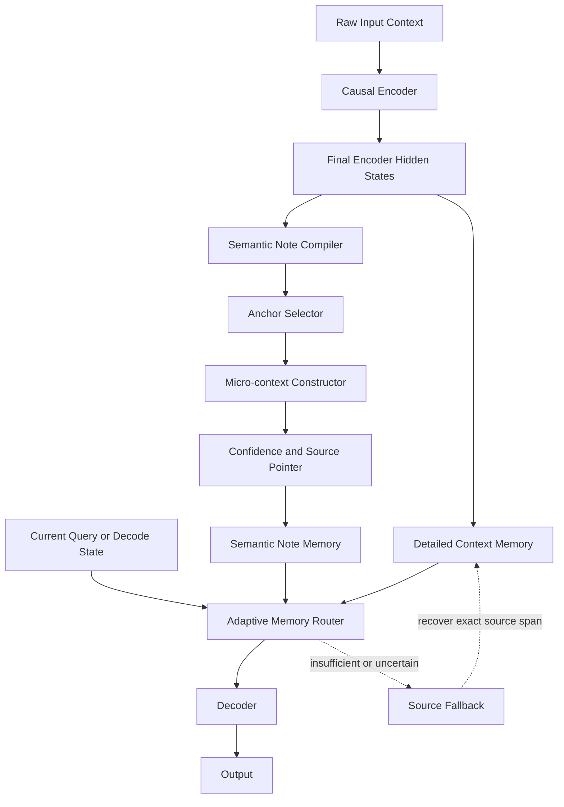
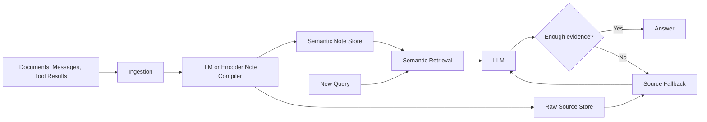

# SN-CED: Semantic Note Memory for Causal Encoder-Decoder LLMs

**Status:** Research prototype  
**Version:** 0.1  
**Date:** 2026-09-18  
**Working name:** SN-CED, Semantic Note Causal Encoder-Decoder  
**Core mechanism:** SNM, Semantic Note Memory

---

## 1. Executive summary

SN-CED is a proposed long-context LLM architecture that adds an explicit semantic memory layer to a Causal Encoder-Decoder model.

The central idea comes from a human study strategy:

1. Read the complete lecture, slide deck, document, or conversation once.
2. Identify the most important **anchor concept**, preferably one word.
3. Attach a very short **micro-context phrase** that preserves what matters about that concept.
4. Keep these compact notes available as working memory.
5. Reason primarily from the notes instead of repeatedly rereading the complete source.
6. Return to the original source only when the notes are insufficient, uncertain, contradictory, or when exact wording or exact numbers are required.

The basic memory unit is therefore:

\[
\boxed{\text{Semantic Note} = \text{Anchor} + \text{Micro-context}}
\]

A production note also carries metadata:

\[
n_i = (a_i, p_i, r_i, c_i, t_i)
\]

where:

- \(a_i\) is the anchor concept
- \(p_i\) is the micro-context
- \(r_i\) is a pointer to the source span
- \(c_i\) is note confidence
- \(t_i\) is optional temporal or version metadata

Example:

```text
Inflation -> prices rise, purchasing power falls
Rates -> higher rates reduce borrowing and demand
Wages -> real income falls when prices outrun pay
Demand -> weaker spending reduces price pressure
```

The research hypothesis is not simply that context can be summarized.

The stronger hypothesis is:

> **After a model has understood an input, a sparse set of explicit anchor-plus-micro-context notes can preserve enough conceptual information for future reasoning that much of the original token-level context no longer needs to remain active.**

The intended benefit is a better **quality vs memory vs compute frontier**.

SN-CED should not be considered proven superior to DeepSeek V4.1, Transformers, RAG, or other memory architectures yet. The tests completed so far provide encouraging evidence that the representation itself is useful and that a learned causal note compiler can preserve task-relevant information under heavy compression. The decisive end-to-end architecture comparison still needs to be completed.

---

## 2. Why this architecture exists

Long-context LLMs usually solve memory by making more original context accessible.

Common approaches include:

- larger attention windows
- KV-cache compression
- sparse attention
- recurrent latent states
- retrieval-augmented generation
- summaries
- vector databases
- learned latent memory
- test-time memory

These mechanisms are valuable, but they often preserve or recover information at the level of tokens, passages, hidden states, chunks, or embeddings.

SNM asks a different question:

> **Once the context has already been understood, what is the smallest explicit conceptual representation needed to reconstruct the useful understanding later?**

A student normally does not replay an entire lecture before answering every exam question.

The student may instead look at notes such as:

```text
Ricardo -> comparative advantage from relative opportunity cost
Phillips -> inflation-unemployment relationship, not structurally fixed
IS curve -> goods-market equilibrium
LM curve -> money-market equilibrium
```

The notes do not contain the lecture. They contain enough semantic triggers and relationships to reactivate the learned conceptual structure.

That is the behavior SNM attempts to reproduce.

---

## 3. Relationship to DeepSeek V4.1-Flash

### 3.1 Verified DeepSeek architecture facts

As of September 18, 2026, DeepSeek V4.1-Flash is described by DeepSeek and its official model card as:

- a 552B-parameter Mixture-of-Experts model
- a 40-layer Causal Encoder-Decoder architecture
- 20 causal encoder layers followed by 20 decoder layers
- approximately 8B active parameters per input token during prefill
- approximately 16B active parameters during decoding
- a decoder global KV cache projected from the final encoder hidden states
- Compressed Sparse Attention 2, or CSA2
- FP4 main KV caching
- approximately 890 bytes per token for the global KV cache
- SWA Bounded Replay
- support for contexts up to one million tokens

Official references:

- DeepSeek announcement: https://www.deepseek.com/en/news/deepseek-v4-1-flash/
- DeepSeek model card: https://huggingface.co/deepseek-ai/DeepSeek-V4.1-Flash
- Technical report: https://huggingface.co/deepseek-ai/DeepSeek-V4.1-Flash/blob/main/DeepSeek_V41_Tech_Report.pdf

### 3.2 What DeepSeek solves

DeepSeek V4.1 makes token-level long context substantially cheaper.

Conceptually:

\[
\text{Large Context}
\rightarrow
\text{Efficient Causal Encoding}
\rightarrow
\text{Compressed Detailed Memory}
\rightarrow
\text{Decoder}
\]

This reduces the cost of preserving and accessing detailed context.

### 3.3 What SNM adds

SNM attacks a different layer of the problem:

\[
\boxed{\text{How much detailed context still needs to exist after it has been understood?}}
\]

The combined hypothesis is:

\[
\text{DeepSeek-style CED}
+
\text{Semantic Note Memory}
\]

could outperform either idea alone on memory-intensive, long-lived workloads.

DeepSeek improves:

\[
\text{bytes and compute per retained token}
\]

SNM attempts to reduce:

\[
\text{the number of original tokens that still require detailed representation}
\]

The mechanisms are therefore potentially complementary.

---

## 4. Core SN-CED architecture



The architecture contains two memory paths.

### Detailed memory

This preserves high-fidelity token-level or latent context.

It is useful for:

- exact quotations
- exact numbers
- details not preserved in notes
- ambiguous concepts
- rare information
- note verification
- contradiction resolution

### Semantic Note Memory

This preserves compressed conceptual memory.

It is intended for:

- conceptual reasoning
- known relationships
- causal chains
- recurring entities
- user preferences
- project state
- summarized decisions
- long-lived agent memory

The decoder should prefer SNM when it is sufficient.

Detailed memory should behave increasingly like a backup store rather than the default working context.

---

## 5. The semantic note

### 5.1 Research definition

The strict research unit is:

\[
n_i = (a_i, p_i)
\]

where:

- \(a_i\) is one semantic anchor
- \(p_i\) is a short phrase preserving the relation or idea attached to the anchor

The original hypothesis should be tested in strict mode using one anchor concept.

A tokenizer may represent one word using multiple subword tokens. The architecture should treat the anchor as one semantic label, not necessarily one tokenizer token.

### 5.2 Production definition

For a usable system:

```python
@dataclass
class SemanticNote:
    anchor: str
    micro_context: str
    source_ref: str | None
    confidence: float
    created_at: float | None
    valid_from: float | None
    valid_to: float | None
    embedding: list[float] | None
```

The embedding is optional.

The explicit text form must remain available because interpretability is part of the architecture's value.

### 5.3 Example

Original text:

```text
After several months of persistent inflation, the central bank increased
the policy rate. Higher borrowing costs reduced credit growth and weakened
aggregate demand. Price pressure subsequently moderated.
```

Possible SNM representation:

```text
Inflation -> persistent price pressure triggered tightening
Rates -> higher borrowing costs reduced credit growth
Demand -> weaker demand moderated price pressure
```

The system should not preserve every sentence merely because it can.

It should preserve the smallest useful conceptual representation.

---

## 6. Semantic Note Compiler

The Semantic Note Compiler is the core learned component.

Its job is:

\[
E(X) \rightarrow N
\]

where:

- \(X\) is the original context
- \(E(X)\) is the causal encoder representation
- \(N\) is the semantic notebook

### 6.1 Compiler responsibilities

The compiler must decide:

1. Is this information worth remembering?
2. What is the best anchor?
3. What is the shortest context phrase that preserves its useful meaning?
4. What source span supports the note?
5. How confident is the model that the note is sufficient and correct?
6. Does this information update an existing note?
7. Is the information temporal?
8. Is it contradictory to another note?
9. Can several notes be consolidated?

### 6.2 Proposed heads

A native implementation can use separate heads over final encoder states:

```text
Encoder states
    |
    +--> Importance Head
    |
    +--> Anchor Head
    |
    +--> Micro-context Head
    |
    +--> Confidence Head
    |
    +--> Source Span Head
```

A first implementation does not need all heads.

Minimum viable version:

```text
Encoder
  -> Importance classifier
  -> Anchor extractor
  -> Micro-context generator
```

### 6.3 Query independence

This requirement is fundamental.

The notebook must normally be created **before future questions are known**.

Otherwise the architecture degenerates into query-conditioned retrieval.

Correct:

```text
Lecture
  -> compile notebook
  -> freeze notebook
  -> receive questions later
```

Incorrect as proof of persistent memory:

```text
Question
  -> inspect lecture
  -> create only notes needed for this question
```

The second process can still be useful as retrieval, but it does not test the core SNM hypothesis.

---

## 7. Memory lifecycle

A complete implementation should eventually support memory tiers.

```text
NEW INFORMATION
      |
      v
Recent token-level memory
      |
      v
Detailed encoded context
      |
      v
Semantic Note Memory
      |
      v
Consolidated long-term semantic memory
```

The intended lifecycle is:

### Stage 1: Observe

The full detail is available.

### Stage 2: Understand

The causal encoder contextualizes the information.

### Stage 3: Compile

Important information becomes semantic notes.

### Stage 4: Consolidate

Repeated or related notes are merged where safe.

### Stage 5: Age

Old detailed context can become cheaper to store or can be evicted from active GPU memory.

### Stage 6: Recall

The model answers primarily from notes.

### Stage 7: Fallback

If note confidence or sufficiency is low, the original source is retrieved.

---

## 8. Adaptive memory router

The router determines what memory is required for the current reasoning step.

Inputs may include:

- decoder hidden state
- current question representation
- matching semantic notes
- note confidence
- note age
- source availability
- contradiction indicators

Conceptually:

\[
g = softmax(Wq)
\]

where:

\[
g =
(g_{SNM}, g_{detail}, g_{source})
\]

A simple implementation can initially use rules.

Example:

```python
if relevant_notes and min_confidence >= threshold:
    use_snm()
else:
    use_detailed_memory()
```

Later this should become learned routing.

### Desired behavior

Question:

```text
Why did higher rates reduce inflation?
```

Use SNM.

Question:

```text
What exact percentage appeared in the third paragraph of the report?
```

Use detailed memory or source fallback.

Question:

```text
The notes contain two conflicting dates. Which one is correct?
```

Use source fallback and update the note store.

---

## 9. Fallback is part of the architecture, not a failure

SNM should not attempt perfect lossy compression of every possible future detail.

That would destroy the purpose of the architecture.

Instead:

\[
\boxed{
\text{Compact semantic memory by default}
+
\text{high-fidelity source recovery when needed}
}
\]

Expected operation:

```text
Query
  |
  v
Search semantic notebook
  |
  +--> sufficient and confident --> reason from notes
  |
  +--> insufficient or uncertain --> fetch detailed source
                                      |
                                      v
                                   answer
                                      |
                                      v
                              optionally repair note
```

The quality of fallback selection should itself be measured.

A good system should:

- fall back when needed
- avoid unnecessary fallback
- recover the correct source
- repair incorrect notes when appropriate

---

## 10. Training objective

The desired optimization problem is:

\[
\min |M|
\]

subject to:

\[
P(y \mid M) \approx P(y \mid X)
\]

where:

- \(X\) is the full context
- \(M\) is semantic memory
- \(y\) is downstream behavior

A practical composite loss could be:

\[
\mathcal{L} =
\mathcal{L}_{task}
+
\lambda_n \mathcal{L}_{note}
+
\lambda_s \mathcal{L}_{sufficiency}
+
\lambda_c \mathcal{L}_{compression}
+
\lambda_f \mathcal{L}_{fallback}
+
\lambda_d \mathcal{L}_{detail-access}
\]

### Task loss

Standard language modeling or downstream task loss.

### Note loss

Supervision for anchor extraction and micro-context construction.

### Sufficiency loss

Require note-only behavior to approximate full-context behavior.

One possible distillation term:

\[
D_{KL}
\left(
P(y \mid X)
\parallel
P(y \mid M)
\right)
\]

### Compression loss

Penalize excessive note count or note length.

Possible form:

\[
\mathcal{L}_{compression}
=
\alpha N_{notes}
+
\beta N_{note\ tokens}
\]

### Fallback loss

Teach the model when notes are insufficient.

### Detailed-access penalty

Penalize unnecessary access to detailed memory:

\[
\mathcal{L}_{detail-access}
=
\gamma \cdot Access(M_D)
\]

This creates an economic incentive inside training.

The model should use expensive detailed memory only when it improves expected answer quality enough to justify the cost.

---

# 11. Experiments completed so far

The current evidence comes from two classes of controlled synthetic tests.

These are **proof-of-concept experiments**, not evidence that SN-CED is superior to DeepSeek V4.1 itself.

---

## 11.1 Experiment A: representation and fallback ablation

### Purpose

Test whether the specific representation:

\[
\text{anchor} + \text{micro-context}
\]

can support reasoning with less active text than raw iterative retrieval.

### Setup

- synthetic lectures
- entities with values and directed links
- irrelevant filler context
- direct questions
- one-hop questions
- two-hop questions
- same 54,920-parameter neural reasoner for each memory condition
- three seeds: 123, 456, 789
- each seed used 1,280 training questions, 240 validation questions, and 480 test questions
- eight answer values, making random chance approximately 12.5%

### Important limitation

The SNM representation in this first experiment was query-conditioned.

It assembled the relevant reasoning chain for each question.

Therefore this experiment tests the **information representation and fallback mechanism**, not autonomous persistent-note construction.

### Conditions

#### Iterative RAG

Retrieve the required raw source sentences.

#### SNM

Use compact anchor-plus-context notes.

#### SNM noisy

Delete required note information in approximately 20% of cases.

#### SNM + fallback

Use noisy notes, but retrieve the missing original source sentence when necessary.

#### Word only

Keep anchors without micro-context.

### Three-seed mean results

| Condition | Accuracy | Mean active tokens per question | Approx. token exposure across 100 questions |
|---|---:|---:|---:|
| Iterative RAG | 100.00% | 43.48 | 4,936.06 |
| SNM | 100.00% | 24.41 | 3,028.83 |
| SNM with missing information | 82.22% | 23.99 | 2,986.61 |
| SNM + selective fallback | 100.00% | 27.70 | 3,357.86 |
| Word only | 12.15% | 16.36 | 2,224.32 |

### Main observations

SNM matched iterative RAG accuracy on this controlled task while using:

\[
43.48 \rightarrow 24.41
\]

active tokens per question.

That is approximately:

\[
\boxed{43.9\% \text{ fewer active tokens}}
\]

The repeated-query exposure estimate dropped from approximately:

\[
4,936 \rightarrow 3,029
\]

or approximately:

\[
\boxed{38.6\% \text{ lower token exposure}}
\]

The word-only condition achieved:

\[
12.15\%
\]

which is essentially random chance for eight answer classes.

This supports the specific hypothesis that the useful unit is not merely an anchor word.

It is:

\[
\boxed{\text{Anchor} + \text{Micro-context}}
\]

When 20% of critical note information was deliberately removed, performance fell to 82.22%.

Selective source fallback restored accuracy to 100% while requiring 27.70 active tokens per question, still substantially below iterative raw retrieval.

### Interpretation

This experiment supports three ideas:

1. The micro-context carries essential information beyond the anchor.
2. Compact semantic notes can be more token-efficient than rereading raw retrieved sentences.
3. Selective fallback can recover information loss without returning to full-time raw-context use.

It does **not** demonstrate that a model can autonomously build the right notes.

That was tested next.

---

## 11.2 Experiment B: learned query-independent causal note compiler

### Purpose

Remove the most important oracle assumption.

The note compiler must read the lecture and construct the notebook **before any question is known**.

### Synthetic lecture structure

Each lecture contained:

- 12 entities
- one value fact per entity
- one directed link fact per entity
- 18 irrelevant filler chunks
- 42 total raw memory chunks

Example raw facts:

```text
The lecture explains that e17 has value v4 and this detail is relevant to the topic.

In the framework e17 connects to e3 and this relation matters later.
```

Target compact representation:

```text
e17 value v4
e17 links e3
```

### Learned compiler

The prototype compiler was a small causal GRU encoder with separate heads for:

- chunk type
- anchor entity
- value target
- link target

Parameter count:

\[
\boxed{22,923}
\]

The compiler processed all chunks before any downstream question was asked.

### Evaluation

Three independent seeds:

- 11
- 22
- 33

For each seed:

- 320 training documents
- 120 held-out test documents
- direct questions
- one-hop questions
- two-hop questions
- four queries per type per document during final information-recovery evaluation

### Mean results across three seeds

| Metric | Mean result |
|---|---:|
| Raw lecture tokens | 573.44 |
| SNM tokens | 71.98 |
| Raw memory slots | 42.00 |
| SNM memory slots | 23.99 |
| Textual token reduction | **87.45%** |
| Memory-slot reduction | **42.87%** |
| Direct QA information recovery | **100.00%** |
| One-hop information recovery | **99.79%** |
| Two-hop information recovery | **100.00%** |
| Overall information recovery | **99.93%** |

Compiler behavior:

- seeds 11 and 22 achieved 100% exact chunk extraction
- seed 33 achieved 99.94% exact chunk extraction
- the small extraction error in seed 33 propagated into one-hop information recovery, which fell slightly to 99.375% for that seed

### Main result

The learned, query-independent notebook compressed:

\[
573.44 \rightarrow 71.98
\]

tokens.

That is:

\[
\boxed{87.45\% \text{ less retained textual memory}}
\]

while the information needed for direct, one-hop, and two-hop reasoning remained recoverable at:

\[
\boxed{99.93\%}
\]

### Critical limitation

The final QA recovery test in Experiment B used deterministic graph traversal over the compiler's predicted semantic notes.

It did **not** use a fully trained autoregressive LLM decoder.

Therefore the correct interpretation is:

> The learned causal compiler preserved almost all information required by the synthetic reasoning tasks under substantial compression.

The incorrect interpretation is:

> SN-CED has already proven superior end-to-end to CED or DeepSeek.

That claim is not supported yet.

---

## 11.3 End-to-end decoder attempts that were not successful

Several tiny CPU-only end-to-end reasoner experiments were attempted.

They are important because negative results should remain part of the research record.

### Attempt 1

A small generic neural reasoner was trained on raw context, gold notes, and predicted notes.

Results from one run:

| Memory | Accuracy |
|---|---:|
| Raw context | 23.54% |
| Gold SNM | 22.92% |
| Predicted SNM | 23.75% |

These results are too low to support any comparison.

The decoder failed to learn the multi-hop task reliably.

### Attempt 2

A small memory-network variant produced approximately:

| Memory | Accuracy |
|---|---:|
| Raw context | 13.13% |
| Predicted SNM | 16.88% |

The note compiler in that specific run also had poor anchor classification, so the result is not interpretable as an architecture comparison.

### Conclusion from failed attempts

Do not use these runs as evidence for or against SNM.

They show that:

- the tiny CPU reader was an experimental bottleneck
- the next comparison needs a stronger and properly validated decoder
- the baseline must first solve the task reliably before memory variants are compared

This is a hard rule for all future tests.

---

# 12. Current evidence level

## Demonstrated

The completed tests support the following statements:

### A. Word-only anchors are insufficient on the synthetic benchmark

Performance was approximately chance.

### B. Anchor plus micro-context preserved the information required by the benchmark

In the representation experiment it matched iterative retrieval with fewer active tokens.

### C. Selective fallback can recover deliberately omitted information

It restored synthetic benchmark performance while retaining a lower active-token count than raw iterative retrieval.

### D. A small learned causal compiler can construct a query-independent semantic notebook

It achieved 99.93% downstream information recovery under 87.45% textual memory compression on the controlled synthetic task.

## Not yet demonstrated

The following claims must **not** be made yet:

- SN-CED is superior to DeepSeek V4.1
- SN-CED is superior to standard Transformers
- SNM reduces real GPU HBM by 87%
- SNM reduces inference cost by 87%
- SNM improves real-world LLM reasoning
- SNM beats strong RAG on real documents
- SNM beats standard summaries
- SNM beats learned latent-memory architectures
- SNM improves latency
- SNM improves energy efficiency
- SNM scales cleanly to millions of tokens

These are test targets.

---

# 13. What would count as architectural superiority

Do not define superiority as one benchmark score.

The desired result is a better **Pareto frontier**.

Let:

\[
Q = \text{task quality}
\]

\[
M = \text{active memory}
\]

\[
C = \text{compute cost}
\]

\[
L = \text{latency}
\]

A strong SN-CED result is one where no baseline can achieve the same \(Q\) with both lower \(M\) and lower \(C\).

Two valid forms of superiority are:

### Efficiency superiority

\[
Q_{SN-CED} \approx Q_{CED}
\]

while:

\[
M_{SN-CED} < M_{CED}
\]

and preferably:

\[
C_{SN-CED} < C_{CED}
\]

### Capability superiority under a fixed budget

\[
M_{SN-CED} = M_{CED}
\]

and:

\[
C_{SN-CED} = C_{CED}
\]

while:

\[
Q_{SN-CED} > Q_{CED}
\]

The first is likely the easier initial target.

---

# 14. Decisive controlled architecture experiment

This is the next priority.

Build two models that are identical except for SNM.

## Baseline

```text
Causal Encoder
   ->
Detailed Context Memory
   ->
Decoder
```

## Experimental model

```text
Causal Encoder
   ->
   +--> Detailed Context Memory
   |
   +--> Semantic Note Compiler --> SNM
                     |
                     v
               Memory Router
                     |
                     v
                   Decoder
```

### Required controls

Both models must use:

- same tokenizer
- same encoder depth
- same decoder depth
- same hidden size
- same attention implementation where applicable
- same training data
- same data order
- same optimizer
- same learning-rate schedule
- same number of training tokens
- comparable parameter count
- same evaluation harness
- same hardware
- multiple random seeds

If SN-CED adds parameters, either:

1. report the additional parameters explicitly, or
2. reduce another noncritical component to create a parameter-matched baseline

Both versions should ideally be reported.

---

# 15. Recommended experimental roadmap

## Phase 0: Reproduce current results

Before changing the architecture, reproduce the existing experiments.

Expected files from the original prototype:

```text
snm_ablation_multiseed.py
snm_ablation_results_123.json
snm_ablation_results_456.json
snm_ablation_results_789.json

snced_learned_compiler.py
snced_compiler_eval.py
snced_compiler_3seed_results.json

snced_learned_results_11.json
snced_memnet_results_11.json
```

The original scripts used `/mnt/data` paths.

When moving them into a repository, refactor all imports and output paths to be repository-relative.

Suggested layout:

```text
snced/
├── README.md
├── pyproject.toml
├── configs/
│   ├── synthetic_small.yaml
│   ├── ced_baseline.yaml
│   └── snced.yaml
├── src/
│   └── snced/
│       ├── __init__.py
│       ├── notes.py
│       ├── compiler.py
│       ├── router.py
│       ├── memory.py
│       ├── fallback.py
│       ├── models/
│       │   ├── ced.py
│       │   └── snced.py
│       └── metrics.py
├── experiments/
│   ├── synthetic/
│   │   ├── ablation.py
│   │   ├── learned_compiler.py
│   │   └── end_to_end.py
│   ├── ruler/
│   ├── babilong/
│   ├── longbench/
│   └── longmemeval/
├── tests/
│   ├── test_notes.py
│   ├── test_compiler.py
│   ├── test_router.py
│   └── test_fallback.py
├── results/
│   ├── raw/
│   ├── tables/
│   └── figures/
└── docs/
    └── architecture.md
```

### Reproduction acceptance criteria

The agent should not proceed until it can approximately reproduce:

- Experiment A SNM accuracy near 100%
- Experiment A word-only accuracy near chance
- Experiment B compression near 87%
- Experiment B information recovery near 99.9%

Minor variation from random seeds is acceptable.

---

## Phase 1: Build a valid end-to-end small CED baseline

Do not add SNM first.

The baseline must solve the task.

Target:

\[
\geq 95\%
\]

synthetic QA accuracy before architecture comparison.

Recommended implementation:

- causal encoder
- encoder-to-decoder projected memory
- autoregressive or classification decoder
- direct, one-hop, and two-hop tasks
- progressively longer distractor context

Log:

- parameters
- training tokens
- wall-clock time
- peak RAM
- peak VRAM when GPU is available
- forward FLOPs if measurable
- context length
- accuracy by question type

Only after the baseline is healthy should SNM be introduced.

---

## Phase 2: Add the Semantic Note Compiler

The compiler must remain query-independent.

Initial target note schema:

```python
SemanticNote(
    anchor=...,
    micro_context=...,
    source_ref=...,
    confidence=...
)
```

Train it jointly or in stages.

Recommended sequence:

1. train CED baseline
2. freeze or partially freeze encoder
3. train note compiler
4. validate note sufficiency
5. add router
6. joint fine-tune

Compare:

```text
CED detailed memory only
CED + SNM only
CED + SNM + fallback
```

---

## Phase 3: Add learned routing and an access cost

The router must learn whether semantic memory is enough.

Use a loss term such as:

\[
\mathcal{L}
=
\mathcal{L}_{task}
+
\lambda_d A_D
+
\lambda_n T_N
\]

where:

- \(A_D\) is detailed-memory access
- \(T_N\) is number of semantic-note tokens

Sweep \(\lambda_d\).

This should produce a quality-vs-cost curve.

The goal is not one operating point.

The goal is to show that SN-CED occupies a better frontier across many budgets.

---

## Phase 4: Run mandatory ablations

A paper-quality result needs the following conditions.

### Memory representations

1. Full detailed context
2. Sliding window
3. Standard RAG chunks
4. Iterative RAG
5. Conventional abstractive summary
6. Hierarchical summary
7. Keyword only
8. Phrase only
9. Anchor + micro-context
10. Anchor + micro-context + source pointer
11. Anchor + micro-context + fallback
12. Learned latent memory if feasible

### SNM-specific ablations

- one note per anchor vs multiple notes per anchor
- 4-token micro-context
- 8-token micro-context
- 16-token micro-context
- 32-token micro-context
- confidence head removed
- source pointers removed
- fallback disabled
- note consolidation disabled
- router replaced by fixed threshold
- query-conditioned compilation vs query-independent compilation
- compiler trained separately vs jointly

The core hypothesis is supported only if **anchor + micro-context** consistently performs better than simpler alternatives at equivalent memory budgets.

---

# 16. Real benchmark suite

Synthetic benchmarks are necessary for causality but insufficient for credibility.

Run at least the following.

## RULER

Purpose:

- long-context retrieval
- multi-hop tracing
- aggregation
- scaling with context length

Repository or paper should be integrated using the current official implementation.

## BABILong

Purpose:

- fact chaining
- deduction
- induction
- reasoning across long natural-language distractors
- contexts that can scale toward very large token counts

## LongBench v2

Purpose:

- realistic long-context tasks
- documents
- multiple documents
- dialogue
- code
- structured data

## LongMemEval

Purpose:

- persistent agent memory
- multi-session reasoning
- temporal reasoning
- knowledge updates
- abstention
- long-lived conversational state

### Context-length sweep

At minimum test:

```text
8K
32K
128K
512K
1M where supported
```

For small models and limited hardware, begin lower and preserve the same logarithmic progression.

---

# 17. Metrics that must be recorded

Token counts alone are not enough.

## Quality

- exact match
- F1
- task success rate
- benchmark-specific score
- direct recall
- one-hop reasoning
- multi-hop reasoning
- temporal correctness
- contradiction handling
- hallucination rate
- abstention accuracy

## Memory

- semantic-note token count
- semantic-note count
- detailed KV bytes
- active HBM
- host RAM
- SSD cache if applicable
- memory transferred between tiers
- compression ratio

## Compute

- prefill FLOPs
- decode FLOPs
- note-compilation FLOPs
- router FLOPs
- fallback FLOPs
- total FLOPs per completed task

## Runtime

- time to first token
- tokens per second
- end-to-end task latency
- prefill latency
- note-compilation latency
- fallback latency
- cache-hit latency

## Economics

If using paid inference:

- input-token cost
- output-token cost
- cache-read cost
- storage cost
- cost per task
- cost per successful task

The preferred commercial metric is:

\[
\boxed{\text{Cost per successful task}}
\]

---

# 18. Required plots

The agent should generate these figures automatically from experiment logs.

## Plot A: Quality vs active memory

X-axis:

```text
active memory bytes or equivalent active tokens
```

Y-axis:

```text
task performance
```

## Plot B: Quality vs total compute

X-axis:

```text
total FLOPs per task
```

Y-axis:

```text
task performance
```

## Plot C: Quality vs context length

Separate curves for:

- CED
- RAG
- summary
- SNM
- SNM + fallback

## Plot D: Cost per task vs context length

This is important for startup viability.

## Plot E: Fallback rate vs quality

This shows how aggressively SNM can compress before source access becomes necessary.

## Plot F: Compression vs quality

This should show the semantic-memory Pareto frontier.

---

# 19. Statistical requirements

Do not report only the best seed.

For serious claims:

- at least 3 seeds for development
- preferably 5 seeds for final synthetic architecture experiments
- bootstrap confidence intervals for benchmark comparisons where appropriate
- report mean and standard deviation
- retain all raw runs
- predefine primary metrics before final benchmark sweep

Do not silently rerun seeds until favorable results appear.

---

# 20. Failure cases that must be explicitly tested

SNM is especially vulnerable to lossy semantic compression.

Create adversarial tests for:

### Exact numbers

```text
Revenue was $18.473 million, not approximately $18 million.
```

### Negation

```text
The treatment did not increase mortality.
```

### Scope

```text
The result applies only to participants over age 65.
```

### Temporal updates

```text
Old: project launches in June
New: project launches in September
```

### Contradictions

Two sources disagree.

### Similar entities

```text
John Smith
John A. Smith
John Smith Jr.
```

### Rare details

Information that looks unimportant initially but becomes important later.

### Long-range causal chains

Five or more hops.

### Counterfactuals

The model must distinguish what happened from what was hypothesized.

### Quotations

Notes are insufficient when exact wording matters.

### Tables and structured data

Compression must not silently destroy row-level distinctions.

These tests are essential because they identify when fallback should activate.

---

# 21. Note consolidation and forgetting

A production architecture cannot simply accumulate semantic notes forever.

Future work should implement consolidation.

Example:

```text
Rates -> raised in March
Rates -> raised again in May
Rates -> tightening cycle continued through June
```

Possible consolidated representation:

```text
Rates -> tightening cycle from March through June
```

But consolidation must preserve source pointers.

A useful objective is:

\[
Utility(n_i)
=
Relevance
\times
Confidence
\times
ExpectedFutureUse
\]

Notes with low utility can be:

- merged
- archived
- compressed further
- evicted from active semantic memory

Do not delete the backing source merely because a note is evicted unless the application explicitly permits it.

---

# 22. Handling updates and contradictions

Semantic memory must not behave as a single overwrite dictionary.

Use versioned notes.

Example:

```text
Launch -> June 2027
valid_until: 2026-09-14

Launch -> September 2027
valid_from: 2026-09-15
```

The query:

```text
When is the launch now?
```

should return September.

The query:

```text
What was the planned launch date last week?
```

may need the previous version.

This is necessary for LongMemEval and real enterprise agents.

---

# 23. Startup implementation path

Do not begin by trying to train a frontier foundation model.

The first commercial product should be model-independent.

## Product concept

**Semantic Memory Runtime for AI Agents**

An application or agent sends events, documents, messages, tool outputs, and decisions into the runtime.

The runtime:

1. ingests new context
2. compiles semantic notes
3. consolidates existing notes
4. retrieves relevant notes for each new task
5. falls back to original context when required
6. records memory and cost metrics

Possible API:

```python
memory.ingest(content, source_id=...)
memory.compile()
context = memory.context(query)
source = memory.fallback(query)
memory.consolidate()
```

Possible response:

```json
{
  "notes": [
    {
      "anchor": "pricing",
      "micro_context": "enterprise plan negotiated to $18k annually",
      "confidence": 0.97,
      "source_ref": "call_2026_09_18#p14"
    }
  ],
  "fallback_required": false
}
```

The runtime can initially sit in front of:

- open-weight models
- hosted LLM APIs
- coding agents
- support agents
- research agents
- enterprise assistants

This allows commercial validation before native SN-CED training is complete.

---

# 24. Startup validation metrics

A customer should be able to see:

```text
Context reduction
Detailed-memory accesses avoided
Fallback rate
Task success
Latency
Cost per successful task
Long-term recall
Memory errors
```

A strong product demonstration might look like:

```text
Task success: equal or better
Context sent to model: -60%
Inference cost: -35%
Fallback rate: 9%
Long-term recall: +8%
```

These numbers are examples of targets, not current results.

---

# 25. Internal go/no-go targets

These are suggested project targets, not established industry standards.

## Research gate

Proceed aggressively if real benchmarks show roughly:

- at least 95% to 99% of baseline quality
- at least 50% reduction in active detailed context or memory
- no major increase in total compute
- reliable fallback
- advantage across more than one benchmark

## Systems gate

Target:

- at least 30% reduction in actual cost per successful long-context task
- or at least 30% reduction in measured GPU memory at equivalent quality
- no unacceptable latency regression
- stable behavior under long-running workloads

## Product gate

On a real agent:

- same or better task completion
- materially lower cost
- better or equal long-term recall
- interpretable memory
- fallback sufficiently rare that savings remain meaningful

If these gates fail, the architecture may still be scientifically interesting, but the startup thesis should be reconsidered.

---

# 26. Immediate engineering task list

The coding agent should execute these in order.

## P0: Repository preparation

- create the repository layout described above
- refactor the existing experiment scripts away from `/mnt/data`
- add deterministic configuration files
- add experiment logging
- add seed management
- add unit tests
- add a results schema

## P1: Reproduce historical experiments

- rerun seeds 123, 456, 789 for the representation ablation
- rerun seeds 11, 22, 33 for the learned compiler
- confirm the reported means
- save raw outputs
- generate a reproducibility report

## P2: Build a strong CED baseline

- implement a small causal encoder-decoder
- validate direct QA first
- validate one-hop
- validate two-hop
- ensure baseline reaches at least 95% on the controlled synthetic task
- do not compare SNM before baseline quality is adequate

## P3: Native SNM branch

- add semantic-note compiler to encoder output
- produce query-independent notes
- include source pointers
- include calibrated confidence
- add note-only decoder memory mode

## P4: Fallback

- implement detailed-memory fallback
- log every fallback
- measure true-positive and false-positive fallback decisions

## P5: Learned router

- start with rule-based routing
- then add learned routing
- introduce detailed-memory access penalty
- sweep the penalty coefficient

## P6: Ablations

Run all mandatory memory-representation ablations.

## P7: Real model integration

Attach SNM as an external runtime to a practical open model first.

Recommended scale progression:

```text
small model for debugging
0.5B to 1.5B model for first real evaluation
7B to 8B model for meaningful systems benchmark
DeepSeek V4.1 class integration only after the mechanism is validated
```

## P8: Real benchmarks

Run:

- RULER
- BABILong
- LongBench v2
- LongMemEval

## P9: Systems profiling

Measure:

- GPU HBM
- KV cache
- prefill time
- decode time
- note compilation
- fallback overhead
- total energy if instrumentation is available

## P10: Product workload

Choose at least one:

- coding agent with repository history
- support agent with long customer histories
- research agent with many documents
- enterprise project agent with decisions and updates

Compare:

```text
long context
RAG
summary memory
SNM
SNM + fallback
```

---

# 27. Implementation rules for the autonomous coding agent

These rules are important.

### Rule 1

Do not claim architecture superiority from synthetic compression alone.

### Rule 2

Never compare memory systems with a baseline decoder that cannot solve the task.

### Rule 3

Keep notebook creation query-independent in persistent-memory experiments.

### Rule 4

Always include the cost of note construction.

### Rule 5

Always include fallback cost.

### Rule 6

Distinguish textual token reduction from real KV/HBM reduction.

### Rule 7

Keep the original source available during research so compression errors are auditable.

### Rule 8

Store raw experiment outputs.

### Rule 9

Do not delete failed experiments.

### Rule 10

Use the same base model and training conditions for controlled comparisons.

### Rule 11

Report negative results.

### Rule 12

Treat exactness, temporal updates, contradictions, and negation as first-class test cases.

---

# 28. Minimum experiment logging schema

Every run should save at least:

```json
{
  "run_id": "",
  "timestamp": "",
  "git_commit": "",
  "seed": 0,
  "model": "",
  "condition": "",
  "dataset": "",
  "context_length": 0,
  "parameters": 0,
  "training_tokens": 0,
  "note_tokens": 0,
  "note_count": 0,
  "fallback_rate": 0.0,
  "accuracy": 0.0,
  "task_success": 0.0,
  "peak_gpu_memory_mb": 0.0,
  "kv_cache_bytes": 0,
  "prefill_ms": 0.0,
  "decode_ms": 0.0,
  "note_compile_ms": 0.0,
  "total_task_ms": 0.0,
  "estimated_flops": 0,
  "cost_usd": 0.0
}
```

Add benchmark-specific fields as necessary.

---

# 29. Recommended first real-world prototype

Before native integration into a large model, build an external SNM runtime.

Pipeline:



This prototype can validate the startup thesis without modifying foundation-model weights.

Once the product behavior is proven, the same logic can be moved into a native SN-CED model.

---

# 30. What makes SNM potentially different from ordinary RAG

RAG asks:

> Which original passages should I reread?

SNM asks:

> What did I already learn from those passages that is sufficient to think with now?

RAG memory unit:

```text
raw chunk
```

SNM memory unit:

```text
anchor -> minimal conceptual relationship
```

RAG is primarily a retrieval mechanism.

SNM is intended as a **memory consolidation mechanism**.

The source remains available, but it is not the preferred working representation.

---

# 31. What makes SNM potentially different from summarization

A standard summary often remains:

- sequential
- paragraph-shaped
- globally generated
- difficult to update locally
- difficult to route by concept
- longer than necessary for many questions

SNM is:

- sparse
- concept-indexed
- modular
- individually updatable
- individually confidence-scored
- source-linked
- designed for selective activation

This difference must be demonstrated empirically through ablations.

It should not be assumed.

---

# 32. Research thesis

A concise formal thesis for a future paper:

> **Long-context language models may not need to preserve all previously understood information at token-level fidelity. We hypothesize that a causal encoder can compile past context into sparse, explicit semantic notes consisting of an anchor concept and minimal relational micro-context, allowing the decoder to reason primarily from conceptual memory while selectively recovering detailed source context when required.**

A stronger version should be used only after end-to-end evidence exists:

> **Semantic Note Memory improves the quality-memory-compute Pareto frontier of Causal Encoder-Decoder language models by replacing a substantial proportion of detailed contextual memory with explicit, source-recoverable conceptual memory.**

---

# 33. Startup thesis

A concise commercial thesis:

> **AI agents should not have to reread everything they have ever seen. SNM continuously converts old context into compact semantic memory, allowing agents to retain useful understanding while reducing repeated context processing and recovering original details only when necessary.**

Potential product category:

```text
Semantic Memory Runtime for AI Agents
```

Potential value proposition:

```text
Long-term agent memory with less context, lower inference cost,
source-level recoverability, and inspectable semantic state.
```

---

# 34. Current bottom line

The project has passed the first proof-of-concept threshold.

The completed experiments show that:

- anchor words alone are not enough
- anchor plus micro-context can preserve the reasoning information in the synthetic tasks
- selective fallback can recover deliberately omitted information
- a learned causal compiler can create query-independent semantic notes
- the learned compiler achieved approximately 87.45% textual compression while preserving approximately 99.93% of the information required by direct, one-hop, and two-hop synthetic questions

The project has **not** yet passed the architecture-superiority threshold.

The next decisive milestone is:

\[
\boxed{
\text{Same CED baseline}
\quad \text{vs} \quad
\text{Same CED + SNM}
}
\]

with:

- a competent decoder
- real end-to-end generation or QA
- multiple seeds
- real long-context benchmarks
- actual GPU memory measurements
- actual latency measurements
- full accounting for note compilation and fallback

If SN-CED matches baseline quality while materially reducing real memory and total cost, the architecture becomes a credible research result.

If that advantage also persists on real agent workloads, it becomes a credible startup foundation.

---

## Appendix A: Historical results at a glance

### Representation ablation, three-seed mean

```text
Iterative RAG
Accuracy:              100.00%
Active tokens/query:    43.48

SNM
Accuracy:              100.00%
Active tokens/query:    24.41

SNM noisy
Accuracy:               82.22%
Active tokens/query:    23.99

SNM + fallback
Accuracy:              100.00%
Active tokens/query:    27.70

Word only
Accuracy:               12.15%
Active tokens/query:    16.36
```

### Learned query-independent compiler, three-seed mean

```text
Compiler parameters:                 22,923
Raw lecture tokens:                  573.44
Semantic-note tokens:                 71.98
Textual memory reduction:             87.45%
Raw memory slots:                     42.00
Semantic-note memory slots:           23.99
Memory-slot reduction:                42.87%
Direct information recovery:         100.00%
One-hop information recovery:         99.79%
Two-hop information recovery:        100.00%
Overall information recovery:         99.93%
```

---

## Appendix B: Core hypothesis in one line

\[
\boxed{
\text{Read once}
\rightarrow
\text{understand}
\rightarrow
\text{write minimal semantic notes}
\rightarrow
\text{reason from notes}
\rightarrow
\text{reopen source only when needed}
}
\]
