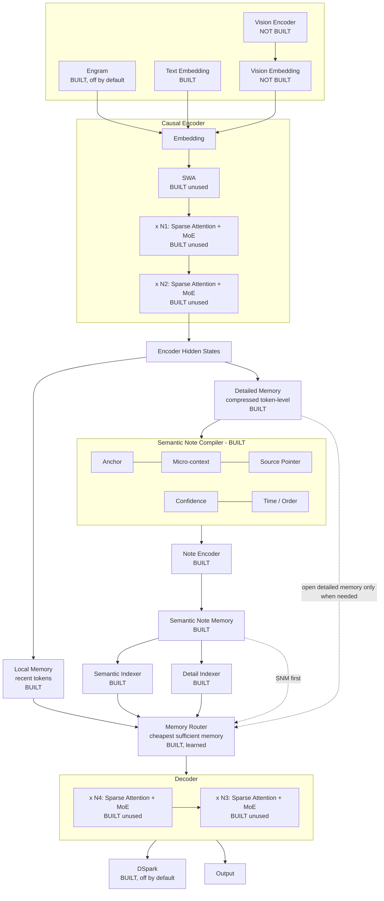

# SN-CED — the target architecture

This is the architecture the project is building toward. Everything in this repository is measured
against it. Boxes are marked **BUILT**, **BUILT (unused)** or **NOT BUILT**; nothing is described as
done unless it is exercised by the test suite.

## Status of every box

| Box | Status | Where |
|---|---|---|
| Text Embedding | BUILT | `models/ced.py` |
| Causal Encoder (stack) | BUILT, dense | `models/ced.py` |
| SWA (sliding-window attention) | BUILT, unused by trained models | `models/layers.py::sliding_window_mask` |
| Sparse Attention | BUILT, unused by trained models | `models/layers.py::topk_sparse_mask` |
| MoE | BUILT, unused by trained models | `models/layers.py::MoEFeedForward` |
| Encoder Hidden States | BUILT | `SNCEDGeneral.encode` |
| Local Memory | BUILT | `models/memory_tiers.py::LocalMemory` |
| Detailed Memory (compressed) | BUILT | `models/memory_tiers.py::CompressedDetailMemory` |
| Semantic Note Compiler: Anchor | BUILT, open-vocabulary pointer | `models/note_compiler.py` |
| ... Micro-context | BUILT, k pointer heads | same |
| ... Source Pointer | BUILT, span start and end | same |
| ... Confidence | BUILT | same |
| ... Time / Order | BUILT, plus a supersession score | same |
| Note Encoder | BUILT, separate module | `models/note_memory.py` |
| Semantic Note Memory | BUILT, one slot per note | same |
| Semantic Indexer | BUILT, top-k | `models/memory_tiers.py::Indexer` |
| Detail Indexer | BUILT, top-k | same |
| Memory Router | BUILT, learned, priced access | `models/sufficiency_router.py` |
| Decoder (stack) | BUILT, dense | `models/ced.py` |
| Output | BUILT | same |
| **Engram** | **BUILT**, off by default | `models/engram.py`; ablation harness `experiments/synthetic/engram_ablation.py` |
| **Vision Encoder / Vision Embedding** | **NOT BUILT** | needs image data and a task |
| **DSpark** | **BUILT**, off by default | `models/dspark.py`; benchmark `experiments/synthetic/dspark_benchmark.py` |

## Engram and DSpark: built, off by default, and evaluated on their own terms

Both are performance components rather than parts of the SN-CED hypothesis, so each is measured
against the evidence its own claim requires.

**Engram** (`models/engram.py`) is a hashed n-gram associative memory: trailing 2-, 3- and 4-grams
are hashed into large embedding tables and the retrieved vectors are gated into the residual
stream, moving reusable lexical and local-pattern knowledge out of attention. At d_model=64 with
2^14 rows per order it adds **3,146,307 parameters for 576 active FLOPs per token** - the trade it
exists to make. Gates start shut (bias -3) so a model that gains nothing can leave them closed, and
`gate_usage()` reports how far they actually opened.

*Evidence required:* a matched ablation, same model and budget with and without, comparing quality
per **active** FLOP while reporting the parameter footprint separately.
`experiments/synthetic/engram_ablation.py` runs exactly that and writes `results/tables/engram_ablation.md`.

One design note worth keeping: normalising the gated sum instead of each table's output silently
cancels the gate, because LayerNorm is scale-invariant. That version left the contribution
unit-sized however shut the gate was, and starved the tables of gradient about magnitude.

**DSpark** (`models/dspark.py`) is a speculative-decoding draft module: three small routed stages
propose a block of future tokens with per-token confidence, and the main decoder verifies the block
in one pass, accepting the longest prefix it agrees with. Because the first disagreement is replaced
by the main model's own choice, **greedy output is bit-identical to decoding without it** - which is
the correctness criterion, tested by `verify_identical_to_greedy`.

*Evidence required:* systems evidence - unchanged output, accepted tokens per verification step,
tokens/second, decode latency. `experiments/synthetic/dspark_benchmark.py` measures all four.

Measured on this benchmark (seed 2, 3-token block): **output identical to greedy, acceptance 0.6%,
0.46x speed** - i.e. slower. That is the expected and honest result: SN-CED answers with 1-3 token
chains, so a draft pass cannot be amortised. The harness proves exactness and measures acceptance,
which is what transfers to long generations.

**Vision Encoder / Vision Embedding** remain **NOT BUILT**. The architecture is modality-agnostic by
construction - the encoder consumes embeddings, so a vision encoder projecting patch features into
the same space drops in. What is missing is the evidence: there is no image dataset or multimodal
task here, so the component could be written but never exercised. Adding it needs a benchmark such
as DocVQA or an image-plus-question set, so the note compiler can be measured on whether it writes
useful notes about image-derived information.

## What "using this architecture" means today

The memory path in the centre column — compiler, note encoder, note memory, both indexers, the
router, and the tiered memories feeding it — is complete and measured. That is the part the
hypothesis rests on, and the results in `results/tables/` come from it.

The surrounding transformer is a small dense stand-in for the MoE/sparse/SWA stack, which is
implemented and unit-tested but switched off, because those components change cost rather than
memory behaviour and slow every experiment on CPU. Turning them on is a configuration change, not
new research: `layers.py` provides all three.
