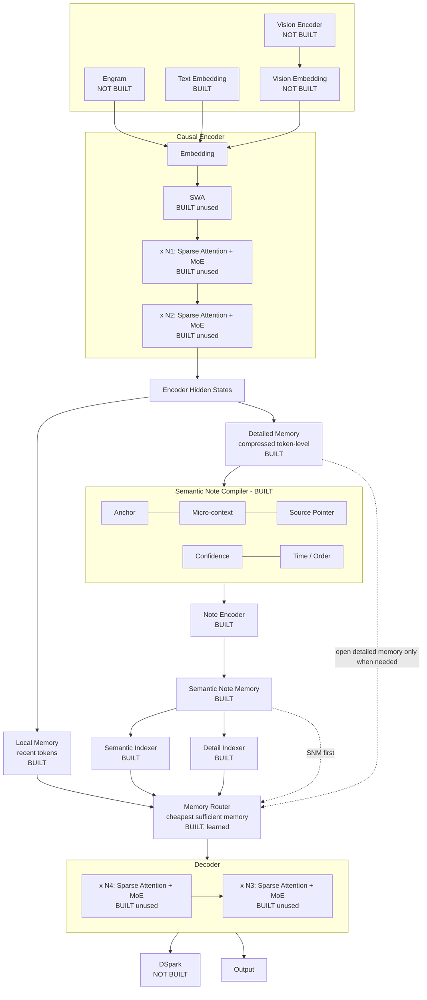

# SN-CED — the target architecture

This is the architecture the project is building toward. Everything in this repository is measured
against it. Boxes are marked **BUILT**, **BUILT (unused)** or **NOT BUILT**; nothing is described as
done unless it is exercised by the test suite.

## Status of every box

| Box | Status | Where |
|---|---|---|
| Text Embedding | BUILT | `models/ced.py` |
| Causal Encoder (stack) | BUILT, dense | `models/ced.py` |
| SWA (sliding-window attention) | BUILT, unused by trained models | `models/layers.py::sliding_window_mask` |
| Sparse Attention | BUILT, unused by trained models | `models/layers.py::topk_sparse_mask` |
| MoE | BUILT, unused by trained models | `models/layers.py::MoEFeedForward` |
| Encoder Hidden States | BUILT | `SNCEDGeneral.encode` |
| Local Memory | BUILT | `models/memory_tiers.py::LocalMemory` |
| Detailed Memory (compressed) | BUILT | `models/memory_tiers.py::CompressedDetailMemory` |
| Semantic Note Compiler: Anchor | BUILT, open-vocabulary pointer | `models/note_compiler.py` |
| ... Micro-context | BUILT, k pointer heads | same |
| ... Source Pointer | BUILT, span start and end | same |
| ... Confidence | BUILT | same |
| ... Time / Order | BUILT, plus a supersession score | same |
| Note Encoder | BUILT, separate module | `models/note_memory.py` |
| Semantic Note Memory | BUILT, one slot per note | same |
| Semantic Indexer | BUILT, top-k | `models/memory_tiers.py::Indexer` |
| Detail Indexer | BUILT, top-k | same |
| Memory Router | BUILT, learned, priced access | `models/sufficiency_router.py` |
| Decoder (stack) | BUILT, dense | `models/ced.py` |
| Output | BUILT | same |
| **Engram** | **NOT BUILT** | needs a definition |
| **Vision Encoder / Vision Embedding** | **NOT BUILT** | needs image data and a task |
| **DSpark** | **NOT BUILT** | needs a definition |

## Why three boxes are empty

**Vision Encoder / Vision Embedding.** The architecture is modality-agnostic by construction: the
encoder consumes embeddings, so a vision encoder projecting patch features into the same embedding
space would drop in. What is missing is not the code but the *evidence* — there is no image dataset
or multimodal task in this project, so the component could be written but never exercised, and an
untested box in a diagram is worse than an honest gap. Adding it needs a multimodal benchmark
(for example DocVQA or a caption-plus-question set) so the note compiler can be measured on
whether it writes useful notes about images.

**Engram.** Appears as a third input alongside text and vision. It has no definition in the research
plan, so there is nothing to implement against. Candidate readings: persistent cross-session memory
loaded as input; a learned prior over what is worth remembering; or an external long-term store the
encoder can read. These are different components with different tests.

**DSpark.** Appears as a decoder output stage beside Output. Also undefined in the plan. Candidate
readings: a speculative or draft decoding head; a verification pass over generated text; or a
sparse output projection.

**To build either, I need one sentence describing what it does and what would count as evidence it
works.** With that, both are implementable and testable.

## What "using this architecture" means today

The memory path in the centre column — compiler, note encoder, note memory, both indexers, the
router, and the tiered memories feeding it — is complete and measured. That is the part the
hypothesis rests on, and the results in `results/tables/` come from it.

The surrounding transformer is a small dense stand-in for the MoE/sparse/SWA stack, which is
implemented and unit-tested but switched off, because those components change cost rather than
memory behaviour and slow every experiment on CPU. Turning them on is a configuration change, not
new research: `layers.py` provides all three.
